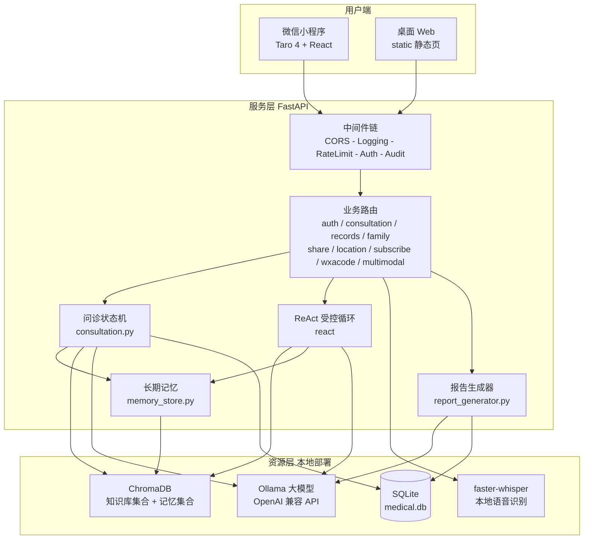
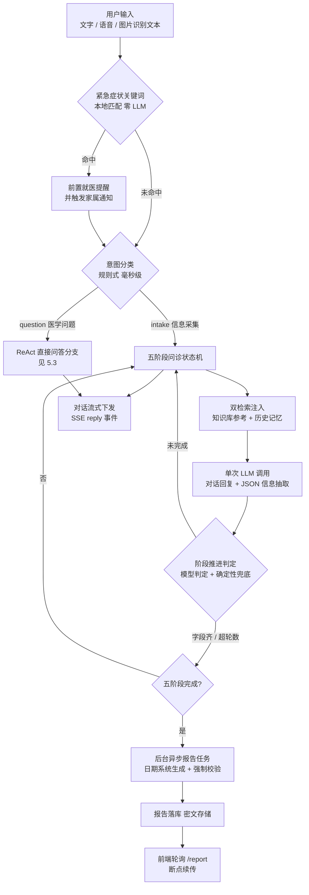
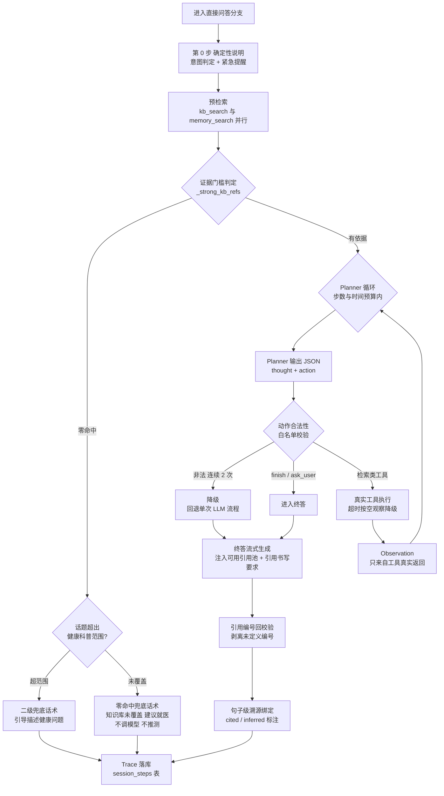
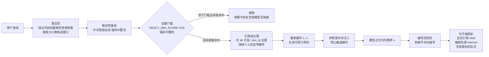
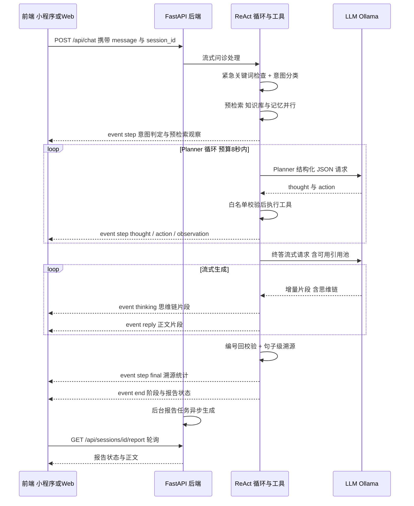

# 医学问诊智能体（medical_bot）项目说明文档

> 一个**本地化部署、可解释、防幻觉**的医疗问诊 AI 智能体：FastAPI 后端 + 微信小程序（Taro）/ 桌面 Web 双端，本地 Ollama 大模型 + ChromaDB 知识库（RAG），配套 ReAct 受控推理、句子级溯源、字段级加密等工程化设计。

---

## 目录

- [一、项目概述](#一项目概述)
- [二、使用说明](#二使用说明)
- [三、核心机制与技术原理](#三核心机制与技术原理)
- [四、智能体防幻觉设计（重点）](#四智能体防幻觉设计重点)
- [五、流程图展示](#五流程图展示)

---

## 一、项目概述

### 1.1 项目定位

本项目面向**医疗健康咨询**场景，构建了一个"像医生一样系统性问诊、像百科一样有据可答"的对话式智能体。与常见"套壳聊天"方案的核心差异在于：

1. **结构化问诊**：通过五阶段状态机系统性采集病史（基本信息 → 主诉现病史 → 既往史 → 系统回顾 → 报告），而非无组织的闲聊；
2. **有据可答**：回答必须基于知识库检索到的真实医学片段，每句话可溯源到具体文档片段；
3. **防幻觉优先**：无依据时宁可明说"知识库未覆盖，建议就医"，也不让模型自由发挥；
4. **全程可解释**：ReAct 推理步骤（思考/行动/观察）实时下发前端展示，推理轨迹落库可回放；
5. **本地化部署**：模型（Ollama）、向量库（ChromaDB）、数据库（SQLite）、语音识别（faster-whisper）全部本地运行，敏感数据不出内网，病历字段级加密存储。

### 1.2 核心功能

| 功能模块 | 说明 |
|---|---|
| 五阶段问诊 | 状态机驱动，逐阶段采集患者信息，支持阶段推进兜底、字段累积合并、禁止重复询问 |
| 直接问答 | 规则式意图识别命中"医学问题"时，走 ReAct 受控推理直接作答，不机械套问诊流程 |
| ReAct 可解释推理 | Thought/Action/Observation 全步骤下发前端（可折叠时间线），并持久化到 `session_steps` 表供历史回放 |
| RAG 知识库 | 医学科普文档（Markdown/PDF）按标题分块入 ChromaDB，检索增强问诊与问答 |
| 句子级溯源 | 终答每句话绑定 `[n]` 引用编号，点击可查看出处片段；无来源的句子如实标注"无直接知识来源" |
| 跨会话长期记忆 | 每轮对话写入独立 Chroma 记忆集合，后续会话语义检索既往对话注入上下文 |
| 多模态输入 | 语音问诊（进程内 faster-whisper，完全离线）+ 检查单/病历照片识别（OpenAI 兼容多模态接口） |
| 问诊报告 | 问诊完成后后台异步生成结构化 Markdown 报告，支持导出 PDF、失败自动重试、断点续传 |
| 微信生态 | wx-login 授权、家庭成员管理、报告分享落地页、订阅消息提醒、小程序码 |
| 安全合规 | JWT 认证、KEK/DEK 两级 AES-256-GCM 字段加密、限流、审计日志、隐私声明页 |

### 1.3 技术栈

| 层次 | 技术 |
|---|---|
| 后端框架 | Python 3.11+ / FastAPI / Uvicorn / Pydantic v2 |
| 大模型 | Ollama（OpenAI 兼容 API）；问诊模型 `qwen2.5:7b-instruct`，嵌入模型 `nomic-embed-text`（768 维），报告/视觉模型可独立配置 |
| 向量检索 | ChromaDB 0.5（知识库集合 + 记忆集合） |
| 数据库 | SQLite（`data/medical.db`），启动时自动迁移 |
| 加密 | cryptography（AES-256-GCM，HKDF 派生 KEK） |
| 小程序端 | Taro 4 + React 18 + TypeScript + Sass，构建产物 `dist/` 由微信开发者工具加载 |
| 桌面端 | 原生 HTML/JS/CSS（`static/`），FastAPI 直接托管 |
| 语音识别 | faster-whisper（进程内本地推理，CPU int8） |

### 1.4 代码结构

```text
medical_bot/
├── main.py                  # 桌面模式入口（DESKTOP_MODE=true 时：旧路由 + 自动开浏览器）
├── config.py                # 全部配置项，均可用 .env 环境变量覆盖
├── consultation.py          # 问诊状态机核心（会话、阶段推进、意图识别、流式分支）
├── llm_client.py            # Ollama/OpenAI 兼容客户端（chat / chat_stream / 思维链拆分）
├── knowledge_base.py        # RAG：文档解析、按标题分块、ChromaDB 检索
├── memory_store.py          # 跨会话长期记忆（独立 Chroma 集合）
├── report_generator.py      # 结构化问诊报告生成（后台任务 + 日期强制校验）
├── database.py              # 桌面模式数据库访问层
├── react/                   # ReAct 受控推理循环
│   ├── types.py             #   Step/Trace/Ref 数据结构 + 句子级溯源解析
│   ├── tools.py             #   工具白名单：kb_search / memory_search / patient_history / finish / ask_user
│   └── loop.py              #   循环编排：预检索 → 证据门槛 → Planner → 终答 → 溯源
├── app/                     # 小程序后端 API（DESKTOP_MODE=false 时启用）
│   ├── main.py              #   应用工厂：中间件链 + 路由装配 + 启动迁移
│   ├── core/                #   crypto（KEK/DEK 加密）、security（JWT）、deps、wx_api
│   ├── middleware/          #   auth / rate_limit / audit / logging
│   ├── routers/             #   auth、consultation、records、family、share、
│   │                        #   location、subscribe、wxacode、multimodal
│   ├── services/            #   认证、会话、记录、家属、订阅、视觉、ASR 服务
│   ├── db/                  #   连接、迁移、仓储（repositories）
│   └── models/              #   Pydantic 模式
├── miniapp/                 # 微信小程序（Taro 源码 src/ → 构建 dist/）
│   └── src/pages/           #   index、consult、records、profile、login、
│                            #   recordDetail、privacy、location、share、family
├── static/                  # 桌面 Web 前端（index.html / chat.js / style.css）
├── data/
│   ├── knowledge/           # 知识库源文档（Markdown / PDF）
│   ├── chroma_db/           # ChromaDB 持久化向量库
│   └── medical.db           # SQLite 数据库
├── tests/                   # 回归测试（阶段推进、医院检索、流式过滤、多模态等）
├── start.bat                # 启动脚本（交互选择 Web / API 模式）
├── start-api.bat            # 直接以小程序后端 API 模式启动
└── requirements.txt
```

---

## 二、使用说明

### 2.1 环境要求

| 依赖 | 要求 | 说明 |
|---|---|---|
| 操作系统 | Windows（当前部署环境） | 桌面模式含自动开浏览器等 Windows 适配 |
| Python | 3.11 及以上 | 项目自带 `.venv` 虚拟环境 |
| Ollama | 已安装并运行 | 默认地址 `http://localhost:11434/v1` |
| 模型 | `qwen2.5:7b-instruct`、`nomic-embed-text` | 问诊低延迟模型 + 768 维嵌入；视觉/报告模型按需 |
| Node.js | 18+（仅小程序开发需要） | 用于 Taro 构建 |
| 微信开发者工具 | 最新稳定版 | 加载 `miniapp/dist/`，基础库建议 ≥ 2.20.1 |
| faster-whisper 权重 | 本地目录（可选） | `ASR_BACKEND=local` 时离线语音识别 |

### 2.2 安装与配置

**1）安装后端依赖**

```bash
cd medical_bot
python -m venv .venv
.venv\Scripts\pip install -r requirements.txt
```

**2）准备模型**

```bash
ollama pull qwen2.5:7b-instruct   # 问诊/问答/Planner 共用（低延迟指令模型）
ollama pull nomic-embed-text      # 嵌入模型（768 维）
```

**3）配置 `.env`**（位于项目根目录，修改后需重启服务生效）

核心配置项一览（完整清单见 `config.py`，均有合理默认值）：

| 配置项 | 默认值 | 说明 |
|---|---|---|
| `API_BASE_URL` | `http://localhost:11434/v1` | Ollama OpenAI 兼容接口地址 |
| `CONSULT_MODEL_NAME` | 回退 `MODEL_NAME` | 问诊/问答/Planner 用模型（推荐 qwen2.5:7b-instruct） |
| `REPORT_MODEL_NAME` | 回退 `MODEL_NAME` | 报告深度分析模型 |
| `EMBEDDING_MODEL` / `EMBEDDING_DIMENSION` | `nomic-embed-text` / 768 | 嵌入模型与维度 |
| `ENABLE_DIRECT_QA` | true | 启用轻量意图识别，医学问题直接作答 |
| `ENABLE_REACT` | false（当前部署已开） | 直接问答分支启用 ReAct 受控循环 |
| `REACT_MAX_STEPS` / `REACT_BUDGET_MS` / `REACT_TOOL_TIMEOUT_MS` | 3 / 8000 / 4000 | 步数预算 / 编排时间预算 / 单工具超时（毫秒） |
| `REACT_MIN_SCORE` | 0.50 | **证据门槛**：低于该相关度的片段不作为作答依据 |
| `REACT_NO_EVIDENCE_STRICT` | true | 零命中时不调模型、直接确定性话术兜底 |
| `REACT_SENTENCE_CITATION` / `REACT_CITATION_CHECK` | true / true | 句子级溯源 / 引用编号回校验 |
| `ENABLE_LONG_MEMORY` / `MEMORY_TOP_K` | true / 3 | 跨会话长记忆开关与注入条数 |
| `STREAMING_OUTPUT` | true | `/chat` 走 SSE 逐段返回 |
| `SHOW_THINKING` | true | 透出推理模型"思考过程"（thinking 事件） |
| `ENABLE_STAGE_GUARD` | true | 阶段推进确定性兜底（防状态机卡死） |
| `ASR_BACKEND` / `ASR_LOCAL_MODEL_DIR` | ollama / 空 | 语音识别后端；`local` 为进程内 faster-whisper 离线方案 |
| `VISION_ENABLED` / `VISION_MODEL` | false / 主模型 | 图片识别开关与多模态模型 |
| `SECRET_KEY` / `MASTER_KEY` | dev 默认 / 自动生成 | JWT 签名密钥 / 字段加密主密钥（**生产必须显式注入**） |
| `WX_APPID` / `WX_SECRET` | 空 | 微信小程序凭据；为空时登录走 dev 模拟 openid，可本地联调 |
| `DESKTOP_MODE` | false | true=桌面单机模式；false=小程序后端 API 模式 |
| `SERVER_HOST` / `SERVER_PORT` | 按模式 / 8000 | 监听地址与端口 |

**4）初始化知识库**

将医学科普文档（`.md` / `.pdf`）放入 `data/knowledge/`，然后：

```bash
.venv\Scripts\python init_knowledge.py        # 首次构建向量库
.venv\Scripts\python update_knowledge.py      # 增量更新文档
```

知识库按 Markdown `##` 标题切块（一个二级标题主题 = 一个块），过短的标题行不会入索引（防止短文本余弦相似度虚高，详见 4.10）。

### 2.3 运行方式

**方式一：小程序后端 API 模式（推荐，联调小程序用）**

双击 `start-api.bat`，或命令行：

```bash
.venv\Scripts\python -m uvicorn app.main:create_app --factory --host 0.0.0.0 --port 8000
```

- 服务地址：`http://127.0.0.1:8000`，健康检查 `/healthz`，接口文档 `/docs`；
- `--host 0.0.0.0` 同时监听局域网，供手机真机联调；
- 未配置 `WX_APPID/WX_SECRET` 时登录走 dev 模拟 openid。

**方式二：桌面 Web 模式（单机使用）**

双击 `start.bat`（交互菜单选 1，等价 `start.bat web`），自动激活虚拟环境、启动服务并打开浏览器聊天界面。

**方式三：小程序端**

```bash
cd miniapp
npm install
npm run build:weapp     # 产物输出到 miniapp/dist/
```

用微信开发者工具打开 `miniapp` 目录（`miniprogramRoot` 指向 `dist/`）：

- 本地联调需在开发者工具"详情 → 本地设置"关闭校验合法域名（`urlCheck=false`）；
- 小程序 API 地址在 `miniapp/src/config/index.ts` 中配置（默认 `http://127.0.0.1:8000`，可用环境变量 `VITE_API_BASE` 覆盖；注意用 `127.0.0.1` 而非 `localhost`，避免 IPv6 解析问题）；
- 修改 `miniapp/src` 后必须重新执行 `npm run build:weapp`。

### 2.4 使用示例

**示例 1：桌面端问诊**

启动桌面模式后浏览器自动打开聊天页 → 输入"头痛三天，伴有恶心" → 智能体按五阶段逐项采集（姓名/性别/年龄 → 症状细节 → 既往史 → 系统回顾）→ 完成后自动生成结构化问诊报告。

**示例 2：API 调用（开发者模式）**

```bash
# 1) 登录换 token（未配置微信凭据时 code 传任意字符串即可）
curl -X POST http://127.0.0.1:8000/auth/wx-login \
  -H "Content-Type: application/json" -d '{"code":"dev-code"}'
# → {"token":"eyJ...", "user_id":1, ...}

# 2) 创建问诊会话
curl -X POST http://127.0.0.1:8000/api/sessions \
  -H "Authorization: Bearer <token>"
# → {"session_id":"...", "stage":1, ...}

# 3) 发起 SSE 流式对话（直接问答分支示例）
curl -N -X POST http://127.0.0.1:8000/api/chat \
  -H "Authorization: Bearer <token>" \
  -H "Content-Type: application/json" \
  -d '{"message":"发烧能不能吃对乙酰氨基酚？","session_id":"<session_id>"}'
# 依次收到 event: step（推理步骤）→ reply（正文片段，句内含 [1] 引用编号）
# → step（final，句子级溯源统计）→ end（阶段/报告状态）

# 4) 获取推理步骤回放 / 报告
curl http://127.0.0.1:8000/api/sessions/<session_id>/steps \
  -H "Authorization: Bearer <token>"
curl http://127.0.0.1:8000/api/sessions/<session_id>/report \
  -H "Authorization: Bearer <token>"
```

**示例 3：小程序端**

打开小程序 → 首页进入"咨询" → 支持三种输入：文字、🎤 语音（说"我最近咳嗽一周了"自动转文字进入问诊）、🖼️ 拍检查单（识别文字后走同一问诊流程）→ 对话完成后"记录"页查看问诊报告，可分享/导出。

**主要 API 端点速览**

| 模块 | 端点 |
|---|---|
| 认证 | `POST /auth/wx-login`、`GET /auth/me`、`PUT /auth/profile` |
| 问诊 | `POST /api/sessions`、`GET /api/sessions`、`GET /api/sessions/latest`、`GET /api/sessions/{id}/history`、`GET /api/sessions/{id}/steps`、`GET /api/sessions/{id}/report`、`POST /api/sessions/{id}/report/retry`、`POST /api/sessions/{id}/reset`、`POST /api/chat`（SSE） |
| 记录 | `GET /api/records`、`GET /api/records/{id}`、`GET /api/records/{id}/report`、`GET /api/records/{id}/export` |
| 家庭 | `GET/POST /api/family`、`PUT/DELETE /api/family/{member_id}`、`POST /api/family/accept`、`GET /api/family/status/{token}` |
| 分享/订阅/小程序码 | `POST/GET /api/share`、`POST /api/subscribe/*`、`POST /api/wxacode` |
| 多模态 | `POST /api/asr`（语音转文字）、`POST /api/vision`（图片识别） |

---

## 三、核心机制与技术原理

### 3.1 双模式架构

`config.DESKTOP_MODE` 决定运行形态：

- **桌面模式（true）**：根 `main.py` 提供旧版 `/chat` 等路由 + 静态页托管 + 自动开浏览器，单机即开即用；
- **API 模式（false）**：`app/main.py` 应用工厂装配完整生产链路：中间件链（CORS → Logging → RateLimit → Auth(JWT) → Audit）+ 九组业务路由 + 启动时自动数据库迁移。

### 3.2 五阶段问诊状态机（`consultation.py`）

1. **单次调用合并三职**：每轮只调用一次 LLM，同时完成"对话回复 + JSON 结构化信息抽取 + 阶段判断"，回复末尾附 JSON 块（患者姓名/性别/年龄/主诉/现病史/既往史/…/`stage_complete`/`next_stage`）；
2. **阶段推进双保险**：模型判定的 `stage_complete` 之外，叠加确定性规则（`_fallback_stage_advance`）——字段收齐即推进、超过轮数上限（`STAGE_MAX_TURNS`）无条件推进，防止 7B 小模型漏输出 JSON 导致状态机永久卡死；
3. **字段累积合并**：自由文本字段（现病史/既往史等）累积合并而非每轮覆盖，防止早期采集的细节被更短的新值顶掉（`CONSULT_FIELDS_MERGE`）；
4. **禁止重复询问**：上下文携带"已收集清单" + 用户消息旁复述紧凑禁重提示 + 确定性剔除针对已收集项的纯重复提问（`_suppress_repeat_question`）；
5. **正则兜底提取**：模型漏输出 JSON 的那一轮，用规则从用户原话补抽年龄/性别，防止信息永久丢失（`CONSULT_REGEX_FALLBACK`）。

### 3.3 意图识别与直接问答

`_classify_intent` 用**纯规则**（关键词 + 短答复判定，零 LLM 开销、毫秒级）把输入分为两类：

- `intake`（信息采集）→ 走五阶段问诊；
- `question`（医学问题，如"发烧能不能吃布洛芬"）→ 走直接问答分支（ReAct 受控循环），有据即答、无据明说。

### 3.4 ReAct 受控推理循环（`react/`，直接问答分支）

针对 7B 小模型专门设计的"受控 ReAct"：

- **Planner 用结构化 JSON 协议**而非自由文本 ReAct 协议（小模型遵循不住自由文本）；
- **Observation 只来自工具真实返回**，模型无法编造观察；
- **双预算闸**：步数预算（`REACT_MAX_STEPS`）+ 编排时间预算（`REACT_BUDGET_MS`，默认 8s，仅约束规划+工具阶段，终答流式不受限）；单次 Planner 超时按预算 0.75 倍封顶（容冷启动、留重试窗口）；
- **降级机制**：Planner 连续 2 次非法输出（JSON 解析失败/未授权工具名）→ 自动回退现有单次 LLM 流程，用户体验无缝；
- **事件协议兼容**：只产出与旧路径同格式的 SSE 事件，新增 `step` 事件老前端自动忽略。

### 3.5 RAG 知识检索（`knowledge_base.py`）

- **分块策略**：按 Markdown `##` 标题层级切分，"一个二级标题主题 = 一个块"，主题纯度显著高于按字数装箱（超长块再按 `###` 二次切分兜底）；
- **短块过滤**：低于 `CHUNK_MIN_INDEX_LEN`（40 字）的块不入索引——短文本余弦相似度虚高（实测 14 字标题行对具体用药问题拿到 0.77 分），会把真正含答案的片段挤出 Top-K；
- **双通道检索**：问诊链路走 `search_for_consultation`（带 0.6 相关度阈值）；ReAct 的 `kb_search` 走**宽召回 + 确定性重排**（见 4.2），门槛由证据闸统一控制。

### 3.6 跨会话长期记忆（`memory_store.py`）

- 每轮问答片段写入独立 Chroma 集合 `consultation_memory`（doc_id 形如 `{session_id}_t{turn_index}`，可回溯具体历史轮次）；
- 后续会话按语义检索既往对话（`MEMORY_TOP_K` 条）注入上下文，**排除当前会话**避免自我引用；
- 过短答复（"是/否"类）不写入，降低噪声。

### 3.7 SSE 流式输出协议

`/api/chat` 以 Server-Sent Events 逐段返回，事件类型：

| 事件 | 含义 |
|---|---|
| `thinking` | 推理模型思维链片段（前端"💭 思考过程"折叠块） |
| `step` | ReAct 推理步骤（thought/action/observation/final，含引用与耗时） |
| `reply` | 正文片段（终答逐字下发） |
| `report` | 报告流式片段 |
| `end` | 轮次结束（stage、report_status、reply_clean 等） |
| `error` | 错误提示 |

流式管线内置 `_VisibleStreamFilter`：把模型输出的 `<think>…</think>` 思维链从正文中剥离，保证正文干净、思维链单独透出。

### 3.8 后台报告生成（`report_generator.py`）

- 问诊完成 → `asyncio.create_task` **后台异步生成**（幂等启动），不随 SSE 断开而中断；
- 失败自动重试（`REPORT_MAX_ATTEMPTS=2`），前端轮询 `/report` 断点续传；
- 报告落库**只由** `_save_to_database` 一处负责，杜绝重复入库。

### 3.9 安全体系（`app/core/` + `app/middleware/`）

- **JWT 认证**：wx-login 换 openid → 签发 token（HS256，默认 7 天）；
- **两级密钥加密**：`MASTER_KEY`（环境变量）—HKDF-SHA256→ `KEK`（不存储）—AES-256-GCM→ 每用户随机 `DEK`（密文存库）—AES-256-GCM→ 字段密文。会话历史、报告、手机号等敏感字段全部密文存储，DEK 进程级 LRU 缓存摊销开销；
- **中间件链**：CORS → 请求日志 → 登录限流（`LOGIN_RATE_LIMIT`）→ 认证 → 审计；
- **数据隔离**：记忆/就诊记录检索均按 `user_id` 作用域隔离。

### 3.10 多模态输入

- **语音**：`/api/asr` → 进程内 faster-whisper（`ASR_BACKEND=local`，CPU int8，权重本地目录），固定中文识别 + 医疗领域初始提示词，转写结果作为文本复用同一问诊流程；
- **图片**：`/api/vision` → OpenAI 兼容多模态 chat（`image_url` 消息），识别检查单/病历文字后进入问诊。

---

## 四、智能体防幻觉设计（重点）

医疗场景中，幻觉（编造医学事实、虚构出处、错误归因）的代价远高于普通场景。本项目把"防幻觉"作为**一等设计目标**，构建了一条从检索到生成到校验的完整防线。以下按数据流顺序展开。

### 4.0 防线总览

| # | 防线 | 位置 | 生效原理 |
|---|---|---|---|
| 1 | 证据门槛 | `react/tools._filter_by_score` | 相关度低于 `REACT_MIN_SCORE` 的片段不进引用池、不作依据 |
| 2 | 强命中豁免 | `react/tools._phrase_bonus` | 精确命中查询实体的片段豁免门槛，防"对症的被拦、沾边的入选" |
| 3 | 宽召回+重排 | `react/tools._wide_consultation_search` | 先宽召回再确定性重排，防"低分但对症"的片段进不了候选 |
| 4 | 零命中兜底 | `react/loop` | 无任何依据时不生成、不推测，直接确定性话术 |
| 5 | Observation 不可编造 | `react/tools.execute_tool` | 观察只来自工具真实返回；白名单外的动作直接拒绝 |
| 6 | 引用池治理 | `react/loop._strong_kb_refs` | 只有知识库片段能占 `[n]`；按 doc_id 去重；抹掉个人史自带编号 |
| 7 | 编号回校验 | `react/types.strip_undefined_cites` | 剥离模型乱标的不存在编号 |
| 8 | 句子级溯源 | `react/types.build_sentence_trace` | 逐句绑定出处，无来源句子如实标注，推断与引用严格区分 |
| 9 | 受控降级 | `react/loop` | Planner 连续非法输出即回退单次 LLM 流程 |
| 10 | 知识库侧配套 | `knowledge_base.py` | 短块不入索引、按标题切块保主题纯度 |
| 11 | 日期铁律 | `report_generator._enforce_visit_date` | 日期一律系统生成，模型写错强制替换 |
| 12 | 提示词约束 | 各 system prompt | "只提取明确提到的信息，不要推测或编造" + 引用书写规范 |

### 4.1 证据门槛与强命中豁免（第一道闸）

**问题**：Chroma 侧 0.6 阈值只挡掉明显无关的结果，剩下的往往是"沾边"片段（实测最高约 0.70 分）。让模型拿沾边段落当证据，等于开门揖盗。

**方案**：`kb_search` 结果统一过 `REACT_MIN_SCORE`（默认 0.50）证据门槛，低于门槛的片段**不进引用池、不作为作答依据**，并在观察里如实告知模型"另有 N 条低相关片段已按证据门槛过滤，未纳入依据"——让模型明确知道"没有依据"，而不是自己脑补。

**关键例外——强命中豁免**：纯语义分与"对症性"会错位。实测问"发烧能不能吃对乙酰氨基酚"时，真正写有该药名的片段语义分只有 0.48，而普通感冒的泛泛段落有 0.58。若死守语义门槛，就会出现**精确的那条被拦下、沾边的反而入选**的反直觉结果。

判定规则（`_phrase_bonus`）：

- 从查询中抽取**不含虚词的 ≥5 字中文连续片段**（`_PHRASE_STOPWORDS` 过滤"可以/什么/怎么"等提问碎片），命中片段文本 → **强命中**：置顶排序 + 豁免语义门槛；
- 4 字命中只给小幅加分、**不豁免**——实测查询虚词碎片（如"可以吃对"）也会命中不相干片段，一并豁免等于把门槛拱手让出。

### 4.2 宽召回 + 确定性重排（防候选丢失）

**问题**：常规检索路径在 Chroma 内部先按 0.6 阈值"砍一刀"再截断 top_k。重排再怎么加分，也救不回一个**没进候选**的片段。

**方案**：`kb_search` 不走带阈值的检索，直连 collection 做**宽召回**（窗口按库大小全量取，百级小库成本仅一次查询，换来确定性召回），然后：

1. 计算每个候选的"语义分 + 短语加成"综合分；
2. **强命中片段直接置顶**（精确命中是确定性事实，不该被一个 0.75 的语义分压过去）；
3. 再截断到 top_k，最后过证据门槛（强命中豁免，见 4.1）。

### 4.3 零命中兜底：不生成、不推测

**问题**：知识库零命中（经门槛过滤后无任何可引用片段）时，若继续让模型推理，它盯着一堆"相关性不足"的资料，很容易顺手补一段医学常识——那就是幻觉。**没有任何依据时，生成得越好越危险。**

**方案**（`react/loop`）：

- 严格模式（`REACT_NO_EVIDENCE_STRICT=true`，默认）：**跳过 Planner、跳过终答 LLM**，直接输出确定性话术 `REACT_NO_EVIDENCE_REPLY`（"知识库未覆盖，建议就医"）。结果 100% 可预期，还省掉一次几十秒的无效生成；
- **二级兜底**：零命中时用 `_OUT_OF_SCOPE_HINTS` 粗判话题是否超出健康科普范围（写诗/编程/股票等），超范围时换用引导话术（`REACT_OUT_OF_SCOPE_REPLY`），把"知识未覆盖"和"话题超出范围"两种情况区分开；
- 非严格模式（回滚开关）：仍生成，但把资料清空、钉死话术后再生成，并做**后置校验**——兜底话术未出现在结果中则强制追加。

### 4.4 Observation 不可编造 + 工具白名单

- **观察只来自工具真实返回值**：ReAct 循环中 Planner 只能"请求"调用工具，Observation 文本完全由 `execute_tool` 的真实结果拼接，模型没有任何渠道撰写观察内容——这是与"自由文本 ReAct"最本质的区别；
- **工具白名单**（`TOOL_WHITELIST`）：只有 `kb_search` / `memory_search` / `patient_history` / `finish` / `ask_user` 五个动作可执行，Planner 臆造的工具名一律拒绝并计入失败次数；
- **超时收敛**：单工具超时（默认 4s）按空观察继续推理，异常收敛为 `ok=False`，绝不中断整轮；
- **敏感信息最小透出**：工具参数下发前端前脱敏截断；就诊记录只回显摘要行，不整段回显。

### 4.5 引用池治理：只有知识库片段配得上 `[n]`

**问题**：记忆（既往对话）与就诊记录属于**个人史**，不是医学依据。它们也自带 `[n]` 编号，若与知识库编号混在一个池里：① 编号语义混乱，用户以为医疗建议有知识出处；② 模型照着记忆块的 `[1]` 写引用，句子被绑到知识库 `[1]` 上——那是**错误归因**，比"不标来源"更糟。

**方案**（`_strong_kb_refs` + `_strip_obscite_marks`）：

1. 终答侧只抽取 `kind=kb` 且达证据门槛的片段进入引用池，按 1..n **重新编号**，与提示词中的【可用引用】严格一一对应；
2. 拼装提示词时用正则**抹掉**记忆/就诊记录观察块自带的 `[n] (时间:/来源:)` 前缀，只留事实内容，杜绝编号对撞；
3. 引用池按 `doc_id` **去重**（同一片段会被预检索与各轮工具重复返回，实测一轮 12 条引用里 9 条是 3 个片段的重复）；
4. 排序规则 `(强命中优先, 分数降序)`：编号从"最对症"那条开始，用户顺着 `[1]` 点开就该看到药名片段。

### 4.6 句子级溯源：cited 与 inferred 严格区分

终答生成后（正文已逐字流式下发，不做改写），`build_sentence_trace` 把正文逐句拆开并绑定出处：

- 模型显式标注 `[n]` 的句子 → `cited=true`，绑定对应知识片段；
- **兜底绑定**：小模型漏写 `[n]` 属高发问题，此时按"句 ↔ 片段字面重合度"（中文二元切分 token，双向取小归一化，阈值 0.30）就近挂源——但挂源的同时标 **`cited=false` + `inferred=true`**。这是关键设计：挂上来源（用户仍可查证）但**不算作有依据**（不把通用表述伪造成有知识出处）；
- 未绑定任何来源的句子**如实显示"无直接知识来源"**，不丢弃、不伪装——用户能看出哪些句子是通用表述；
- 溯源结论**自解释**：终答步骤按三种情形如实说明——"N 句中 M 句显式引用知识片段"；"知识库有 K 条相关片段但未被引用，属模型自由作答，请谨慎采纳"；"知识库无可用依据，未作医学推测"。只丢一个"0 句带来源"的数字，用户无从判断是检索没命中还是模型没标注。

### 4.7 引用编号回校验

小模型偶尔乱标不存在的编号（如正文里的 `[9]` 但引用池只有 3 条）。`REACT_CITATION_CHECK` 开启时，终答完成后扫描正文所有 `[n]`：

- 只保留在"可用引用"集合内的编号；
- 未定义编号**剥离**并记入 final 步骤（"已剥离未定义编号 [9]"），句子溯源在清洗后的文本上重算——防止用户点开一个不存在的出处。

### 4.8 受控降级：出错时退回已知安全路径

- Planner JSON 解析采用三级降级（直接解析 → 去 Markdown 围栏 → 首尾括号回溯），仍失败连续 2 次 → 整轮回退"单次 LLM 流程"（项目原有成熟路径）；
- 降级事件以 `fallback` 步骤如实告知（"规划模型连续输出异常，已回退为单次问答流程"），不留静默黑洞；
- 工具/检索层异常同样收敛降级（Chroma 偶发连接异常时**重建客户端重试一次**），保证可解释性链路不因基础设施抖动而整轮失明。

### 4.9 提示词级约束

- 问诊系统提示词：**"只提取对话中明确提到的信息，不要推测或编造"**——结构化字段抽取的铁律；
- 终答引用书写要求：**"只允许使用上方【可用引用】中给出的编号，禁止编造编号"**，每个事实性陈述后紧跟 `[n]`；
- 零命中场景（非严格模式）的提示词直接钉死："禁止推测、禁止补充医学常识，必须原样输出这句话：……"。

### 4.10 知识库侧配套：从源头提高证据质量

- **短块不入索引**（`CHUNK_MIN_INDEX_LEN=40`）：按标题分块后只剩一行 H1 标题的引言块（11~16 字）没有任何信息量，但短文本余弦相似度虚高——实测一个 14 字标题行对具体用药问题拿到 0.77 分，会把真正含药名的片段挤出 Top-K。源头过滤后此类噪声不再进入候选；
- **按 `##` 标题切块**：一个二级标题主题 = 一个块，主题纯度显著高于按字数装箱（旧方案 114/117 块跨多个标题），检索命中的片段天然边界清晰、可独立成证。

### 4.11 日期时间铁律

**任何日期都不让 LLM 生成**：实测让模型填日期会输出 2023 年旧日期。报告生成器统一用系统时间（`current_time_str()`），并通过 `_enforce_visit_date` 在流式输出与最终落盘两个位置**强制校验/替换/补写**就诊日期行；提示词中明确"就诊日期已由系统生成，必须原样照抄"。推理步骤的时间戳同样来自系统（`now_iso()`），与模型输出无关。

### 4.12 小结

一句话概括本项目的防幻觉哲学：

> **能确定的绝不交给模型**（意图分类、阶段推进兜底、日期、紧急提醒用规则）；**模型说的必须可验证**（引用池、编号回校验、句子级溯源）；**验证不了的宁可承认不知道**（零命中兜底、无来源句如实标注、推断与引用严格区分）。

---

## 五、流程图展示

> 以下流程图使用 Mermaid 语法，可在 GitHub、Typora、VS Code（装 Mermaid 插件）等主流 Markdown 渲染器中直接渲染。

### 5.1 总体架构



### 5.2 问诊主流程（输入 → 输出）



### 5.3 ReAct 受控推理循环（直接问答分支核心）



### 5.4 防幻觉证据流水线



### 5.5 SSE 交互时序（一轮直接问答）



---

## 附：注意事项

1. **修改 `.env` 后必须重启服务**才生效；
2. 小程序改 `miniapp/src` 后必须重新 `npm run build:weapp`，开发者工具加载的是 `dist/`；
3. 单元测试需注意：`kb_search` 走宽召回会**穿透打桩的 `search_for_consultation` 直连真实知识库**，测试需同时替换 `react.tools._wide_consultation_search`；
4. 模型调用必须**显式传 `model=` 参数**（复用 `CONSULT_MODEL_NAME`），否则会静默回退默认推理模型导致十倍延迟；
5. `conversation_history` 与 `report` 落库为**密文**，读取方必须先 `crypto.decrypt_record()` 解密再 `json.loads`；
6. 生产部署务必通过环境变量注入 `SECRET_KEY` 与 `MASTER_KEY`，小程序正式环境需 HTTPS 并在小程序后台配置合法 request 域名。
